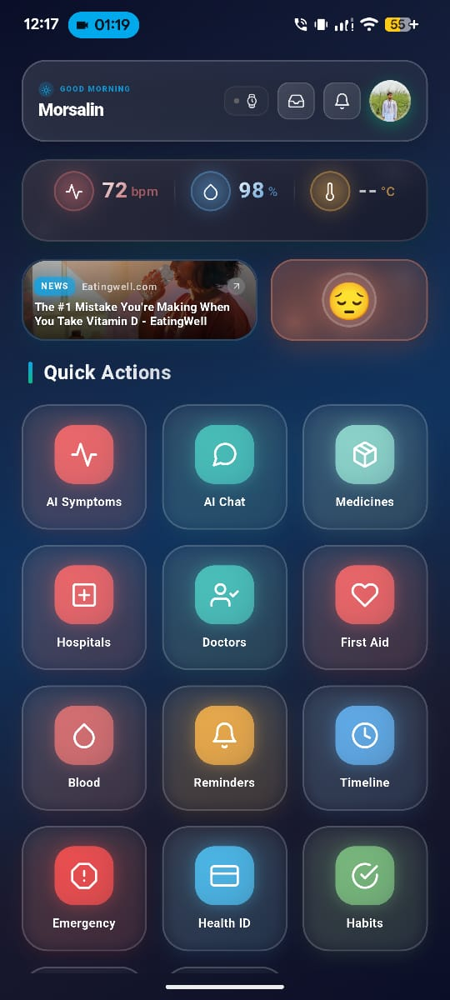
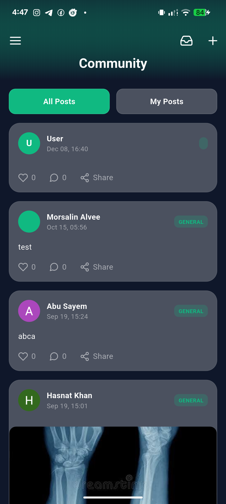
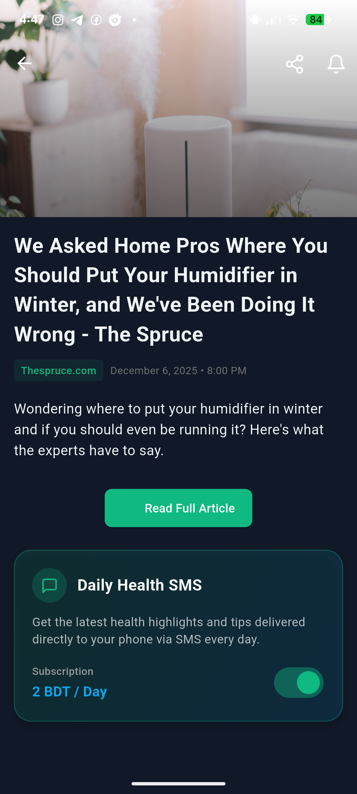
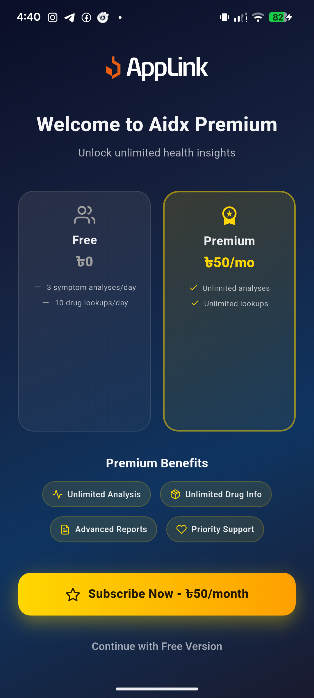

# Aidx - AI-Powered Medical Assistant

<div align="center">
  
  
  
  
  
  <br>
  
  
  
</div>

<div align="center">
  <h2>🏥 Your Personal AI Medical Companion 🏥</h2>
  <p>
    A comprehensive AI-powered medical assistant app built with Flutter, featuring
    <strong>Applink API integration</strong>, wearable connectivity, symptom analysis, voice chat, and comprehensive health monitoring capabilities.
  </p>
</div>

---

## 📱 Download APK

<div align="center">
  <a href="https://drive.google.com/file/d/1OKz15l7OTQoQxHIxZRadvTLUGAhJPH5Z/view?usp=drive_link">
    
  </a>
</div>

## ✨ Features

### 📡 <span style="color: #FF6B35; font-weight: bold;">Applink API Integration</span>
<div style="background: linear-gradient(135deg, #667eea 0%, #764ba2 100%); padding: 15px; border-radius: 10px; margin: 10px 0; color: white;">
  <strong>🚀 Core Telecom Features:</strong>
  <ul>
    <li>📱 <strong>Telecom Subscription Management</strong> - Seamless user subscription handling via mobile network operator APIs</li>
    <li>💬 <strong>SMS Subscription Service</strong> - Automated SMS-based subscription activation and management</li>
    <li>🔄 <strong>USSD API Integration</strong> - Unstructured Supplementary Service Data for interactive mobile services</li>
    <li>🔐 <strong>OTP Verification</strong> - Secure one-time password authentication for user verification</li>
    <li>💳 <strong>Subscriber Billing</strong> - Integrated charging and billing information management</li>
    <li>🔔 <strong>Push Notifications</strong> - Automated notifications to subscribed users</li>
    <li>📊 <strong>Real-time Subscriber Data</strong> - Live subscriber base size and charging status tracking</li>
  </ul>
</div>

### 🤖 <span style="color: #00BCD4; font-weight: bold;">AI-Powered Health Analysis</span>
<div style="background: linear-gradient(135deg, #f093fb 0%, #f5576c 100%); padding: 15px; border-radius: 10px; margin: 10px 0; color: white;">
  <ul>
    <li>🔍 <strong>Symptom Analysis</strong> - Advanced AI symptom checker with personalized health insights</li>
    <li>🎙️ <strong>Voice Chat</strong> - Real-time voice conversations with AI medical assistant (responses limited to 50 words for clarity)</li>
    <li>📄 <strong>Medical Report Analyzer</strong> - Upload and analyze medical reports, lab results, and prescriptions</li>
    <li>💊 <strong>Drug Information</strong> - Comprehensive medication database with interactions and side effects</li>
  </ul>
</div>

### 📱 <span style="color: #8BC34A; font-weight: bold;">Health Monitoring & Wearables</span>
<div style="background: linear-gradient(135deg, #4facfe 0%, #00f2fe 100%); padding: 15px; border-radius: 10px; margin: 10px 0; color: white;">
  <ul>
    <li>⌚ <strong>Wearable Integration</strong> - Connect with Android Wear OS devices for real-time vitals</li>
    <li>❤️ <strong>Vital Signs Tracking</strong> - Heart rate, SpO2, temperature monitoring</li>
    <li>😴 <strong>Sleep & Fall Detection</strong> - Advanced sleep tracking and fall detection alerts</li>
    <li>📈 <strong>Health Timeline</strong> - Complete health history and trends visualization</li>
  </ul>
</div>

### 🏥 <span style="color: #FF9800; font-weight: bold;">Medical Services</span>
<div style="background: linear-gradient(135deg, #fa709a 0%, #fee140 100%); padding: 15px; border-radius: 10px; margin: 10px 0; color: white;">
  <ul>
    <li>🏥 <strong>Hospital Finder</strong> - Locate nearby hospitals with real-time availability</li>
    <li>💊 <strong>Pharmacy Locator</strong> - Find pharmacies and check medication availability</li>
    <li>🩸 <strong>Blood Donation</strong> - Connect with blood donation centers and campaigns</li>
    <li>🚑 <strong>First Aid Guide</strong> - Emergency first aid instructions and procedures</li>
  </ul>
</div>

### 👥 Community & Social
- **Community Support**: Connect with healthcare professionals and patients
- **Health ID System**: Secure digital health identity management
- **Appointment Booking**: Schedule consultations with healthcare providers
- **Emergency SOS**: One-tap emergency contact system

### 🔒 Premium Features
- **Subscription Model**: Premium features with usage limits
- **Advanced Analytics**: Detailed health insights and predictions
- **Priority Support**: Direct access to healthcare professionals
- **Unlimited AI Consultations**: Extended AI interaction capabilities

## 📸 Screenshots

### 🏠 Main Dashboard
<div align="center">
  
  <p><em><strong>Main Dashboard</strong> - Your central hub for health monitoring, AI assistance, and medical services</em></p>
</div>

### Key Features Preview

| Dashboard & Vitals | AI Symptom Analysis | Voice Chat |
|--------------------|-------------------|------------|
|  |  |  |

### Medical Services

| Hospital Finder | Pharmacy & Doctor | Blood Donation |
|----------------|------------------|----------------|
|  |  |  |

### Health Management

| Health Timeline | Medication Reminder | Health Habits |
|----------------|-------------------|---------------|
|  |  |  |

### Advanced Features

| Report Analyzer | Prescription Scanner | First Aid Guide |
|----------------|---------------------|-----------------|
|  |  |  |

### Community & Security

| Community Support | Health ID | Auto SOS Service |
|-------------------|-----------|------------------|
|  |  |  |

### Additional Features

| Drug Info | News | Smart Device Connect | Subscription |
|-----------|------|---------------------|--------------|
|  |  |  |  |

| OTP Login | Symptoms History |
|-----------|------------------|
|  |  |

## 🚀 Getting Started

### 📋 Prerequisites

<div style="background: linear-gradient(135deg, #e3f2fd 0%, #f3e5f5 100%); padding: 15px; border-radius: 10px; margin: 10px 0;">
  <strong>System Requirements:</strong>
  <ul>
    <li>🔹 <strong>Flutter</strong>: Version 3.0 or higher</li>
    <li>🔹 <strong>Dart</strong>: Version 3.0 or higher</li>
    <li>🔹 <strong>Android Studio</strong> or <strong>VS Code</strong> with Flutter extensions</li>
    <li>🔹 <strong>Android SDK</strong> (API level 21+ for Android)</li>
    <li>🔹 <strong>Xcode</strong> (for iOS development on macOS)</li>
  </ul>
</div>

### ⚡ Quick Setup

<div style="background: linear-gradient(135deg, #fff3e0 0%, #fce4ec 100%); padding: 20px; border-radius: 10px; margin: 10px 0;">

  <h4>1️⃣ Clone & Install</h4>
  ```bash
  git clone https://github.com/Alvee0033/aidx-medical-app.git
  cd aidx-medical-app
  flutter pub get
  ```

  <h4>2️⃣ Environment Setup</h4>
  <p>Create a <code>.env</code> file in the project root:</p>

  ```env
  # Applink API Configuration (Primary)
  APPLINK_APPLICATION_ID=your_applink_app_id_here
  APPLINK_PASSWORD=your_applink_password_here
  APPLINK_BASE_URL=https://aidx-applink-proxy.fly.dev/applink

  # AI Services
  GROQ_API_KEY=your_groq_api_key_here

  # Firebase Configuration
  FIREBASE_API_KEY=your_firebase_api_key_here

  # Supabase (Optional)
  SUPABASE_URL=your_supabase_url_here
  SUPABASE_ANON_KEY=your_supabase_anon_key_here
  ```

  <h4>3️⃣ Configure Firebase</h4>
  <ul>
    <li>Create a Firebase project at <a href="https://console.firebase.google.com/">Firebase Console</a></li>
    <li>Enable Authentication, Firestore, and Storage</li>
    <li>Download <code>google-services.json</code> and place it in <code>android/app/</code></li>
    <li>Download <code>GoogleService-Info.plist</code> and place it in <code>ios/Runner/</code> (for iOS)</li>
  </ul>

  <h4>4️⃣ Run the App</h4>
  ```bash
  flutter run
  ```
</div>

4. **Configure Firebase**

   - Create a Firebase project at [Firebase Console](https://console.firebase.google.com/)
   - Enable Authentication, Firestore, and Storage
   - Download `google-services.json` and place it in `android/app/`
   - Download `GoogleService-Info.plist` and place it in `ios/Runner/` (for iOS)

5. **Configure Supabase** (Optional)

   - Create a Supabase project at [Supabase](https://supabase.com/)
   - Get your project URL and anon key
   - Update the `.env` file with Supabase credentials

### API Keys Setup

#### Groq API (for AI features)
1. Sign up at [Groq](https://groq.com/)
2. Get your API key from the dashboard
3. Add it to your `.env` file as `GROQ_API_KEY`

#### Firebase Configuration
1. Go to Firebase Console → Project Settings → General
2. Scroll to "Your apps" section
3. Copy the API key and other config values
4. Add to `.env` as `FIREBASE_API_KEY`

## 🛠️ Build & Run

### Android
```bash
flutter build apk --release
# or for development
flutter run
```

### iOS (macOS only)
```bash
flutter build ios --release
# or for development
flutter run
```

### Web
```bash
flutter build web --release
# or for development
flutter run -d chrome
```

## 📁 Project Structure

```
lib/
├── config/           # Configuration files
├── models/           # Data models
├── providers/        # State management
├── repositories/     # Data repositories
├── screens/          # UI screens
├── services/         # Business logic services
├── utils/            # Utility functions
└── widgets/          # Reusable UI components

android/              # Android-specific code
ios/                  # iOS-specific code
assets/               # Images, sounds, fonts
```

## Key Services

### Core Services
- ApplinkService: Primary telecom API integration for subscription management, OTP verification, and billing
- GeminiService: AI-powered medical analysis using Groq API
- FirebaseService: Authentication and data persistence
- WearableService: Android Wear OS integration
- NotificationService: Push notifications and alerts

### Health Services
- HealthProvider: Health data management
- VitalsService: Vital signs monitoring
- SleepDetectionService: Sleep and fall detection
- EmergencyService: SOS and emergency contacts

## UI/UX Features

- Material Design 3: Modern, accessible design system
- Dark/Light Theme: Automatic theme switching
- **Responsive Layout**: Optimized for all screen sizes
- **Animations**: Smooth transitions and micro-interactions
- **Accessibility**: Screen reader support and high contrast

## Security & Privacy

- **End-to-end Encryption**: All health data encrypted
- **Secure Authentication**: Firebase Auth with multi-factor support
- **Data Privacy**: HIPAA-compliant data handling
- **API Key Protection**: Environment variables, no hardcoded keys
- **Secure Storage**: Encrypted local data storage

## 🧪 Testing

Run tests:
```bash
flutter test
```

Run integration tests:
```bash
flutter drive --target=test_driver/app.dart
```

## 📦 Deployment

### Android Play Store
1. Build release APK/AAB
2. Create Play Store listing
3. Upload and publish

### iOS App Store
1. Build for iOS
2. Create App Store Connect record
3. Submit for review

### Web Deployment
```bash
flutter build web --release
# Deploy to hosting service (Firebase Hosting, Vercel, etc.)
```

## 🤝 Contributing

<div style="background: linear-gradient(135deg, #e8f5e8 0%, #f3e5f5 100%); padding: 15px; border-radius: 10px; margin: 10px 0;">
  <strong>💡 We welcome contributions!</strong>
  <ol>
    <li>Fork the repository</li>
    <li>Create a feature branch (<code>git checkout -b feature/amazing-feature</code>)</li>
    <li>Commit your changes (<code>git commit -m 'Add amazing feature'</code>)</li>
    <li>Push to the branch (<code>git push origin feature/amazing-feature</code>)</li>
    <li>Open a Pull Request</li>
  </ol>
  <p><strong>Guidelines:</strong></p>
  <ul>
    <li>Follow Flutter best practices</li>
    <li>Write comprehensive tests</li>
    <li>Update documentation</li>
    <li>Ensure code quality with <code>flutter analyze</code></li>
  </ul>
</div>

## 📄 License

<div align="center">
  
</div>

This project is licensed under the MIT License - see the [LICENSE](LICENSE) file for details.

## 🙏 Acknowledgments

<div style="background: linear-gradient(135deg, #fff8e1 0%, #fce4ec 100%); padding: 15px; border-radius: 10px; margin: 10px 0;">
  <strong>🌟 Special Thanks To:</strong>
  <ul>
    <li>🚀 <strong>Flutter Team</strong> for the amazing framework</li>
    <li>🔥 <strong>Firebase</strong> for backend services</li>
    <li>🤖 <strong>Groq</strong> for AI capabilities</li>
    <li>📡 <strong>Applink API</strong> for telecom integration</li>
    <li>🗄️ <strong>Supabase</strong> for additional backend features</li>
    <li>🎨 <strong>Material Design</strong> for design inspiration</li>
  </ul>
</div>

## 📞 Support

<div align="center">
  <p>For support, email <strong>support@aidx.com</strong> or join our community</p>
  <p><em>Made with ❤️ for better healthcare accessibility</em></p>
</div>

---

<div align="center">
  <p><strong>🏥 Aidx - Your AI Medical Companion 🏥</strong></p>
  <p>Transforming healthcare with AI-powered technology</p>
</div>

## 📞 Support

For support, email support@aidx.com or join our [Discord community](https://discord.gg/aidx).

## 🗺️ Roadmap

- [ ] iOS Wear OS support
- [ ] Advanced AI diagnostics
- [ ] Telemedicine integration
- [ ] Multi-language support
- [ ] Offline functionality
- [ ] Integration with electronic health records

---

**Made with ❤️ for better healthcare accessibility**